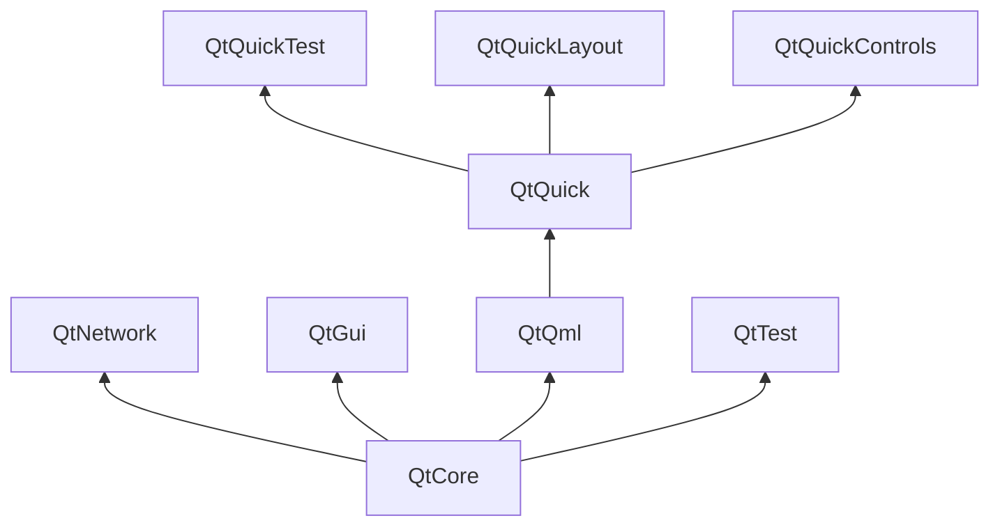

# Construccón de Bloques Qt 

Qt 6 consta de una gran cantidad de módulos. En general, un módulo es una biblioteca para que la use el desarrollador. Algunos módulos son obligatorios para una plataforma habilitada para Qt y forman el conjunto denominado *Módulos Qt Essentials*. Otros módulos son opcionales y forman los *Qt Add-On Modules*. Es posible que la mayoría de los desarrolladores no necesiten usar este último, pero es bueno conocerlos, ya que brindan soluciones invaluables para desafíos comunes.

## Modulos Qt

Los módulos Qt Essentials son obligatorios para cualquier plataforma habilitada para Qt. Ofrecen la base para desarrollar aplicaciones Qt 6 modernas usando Qt Quick 2. La lista completa de módulos está disponible en la [lista de módulos de documentación de Qt](https://doc.qt.io/qt-6/qtmodules.html#qt-essentials).

## Módulos esenciales básicos 
El conjunto mínimo de módulos Qt 6 para iniciar la programación QML.

* **Qt Core** - Clases básicas no gráficas utilizadas por otros módulos.
* **Qt D-BUS** - Clases para la comunicación entre procesos sobre el protocolo D-Bus en Linux.
* **Qt GUI** - Clases base para componentes de interfaz gráfica de usuario (GUI). Incluye OpenGL.
* **Qt Network** - Clases para hacer la programación en red más fácil y portátil.
* **Qt QML** - Clases para lenguajes QML y JavaScript.
* **Qt Quick** - Un marco declarativo para crear aplicaciones altamente dinámicas con interfaces de usuario personalizadas.
* **Qt Quick Controls** - Proporciona tipos de QML ligeros para crear interfaces de usuario de alto rendimiento para dispositivos de escritorio, integrados y móviles. Estos tipos emplean una arquitectura de estilo simple y son muy eficientes..
* **Qt Quick Layouts** - Los diseños son elementos que se utilizan para organizar elementos basados ​​en Qt Quick 2 en la interfaz de usuario.
* **Qt Quick Test** - Un marco de prueba de unidad para aplicaciones QML, donde los casos de prueba se escriben como funciones de JavaScript.
* **Qt Test** - Clases para pruebas unitarias de aplicaciones y bibliotecas Qt.
* **Qt Widgets** - Clases para ampliar Qt GUI con widgets de C++.

## Módulos complementarios de Qt (Qt Add-On Modules)

Además de los módulos esenciales, Qt ofrece módulos adicionales que apuntan a propósitos específicos. Muchos módulos complementarios tienen funciones completas y existen para la compatibilidad con versiones anteriores, o solo se aplican a ciertas plataformas. Aquí hay una lista de algunos de los módulos complementarios disponibles, pero asegúrese de familiarizarse con todos ellos en el [Lista de complementos de documentación de Qt](https://doc.qt.io/qt-6/qtmodules.html#qt-add-ons) y en la lista de abajo.

* **Network**: Qt Bluetooth / Qt Network Authorization
* **UI Components**: Qt Quick 3D / Qt Quick Timeline / Qt Charts / Qt Data Visualization / Qt Lottie Animation / Qt Virtual Keyboard
* **Graphics**: Qt 3D / Qt Image Formats / Qt OpenGL / Qt Shader Tools / Qt SVG / Qt Wayland Compositor
* **Helper**: Qt 5 Core Compatibility APIs / Qt Concurrent / Qt Help / Qt Print Support / Qt Quick Widgets / Qt SCXML / Qt SQL / Qt State Machine / Qt UI Tools / Qt XML

::: tip
Como estos módulos no son parte del lanzamiento, el estado de cada módulo puede diferir dependiendo de cuántos colaboradores estén activos y qué tan bien se haya probado.
:::

## Plataformas compatibles

Qt es compatible con una variedad de plataformas, incluidas las principales plataformas integradas y de escritorio. A través de Qt Application Abstraction, ahora es más fácil que nunca migrar Qt a su propia plataforma si es necesario.

Probar Qt 6 en una plataforma requiere mucho tiempo. El Proyecto Qt seleccionó un subconjunto de plataformas para construir el conjunto de plataformas de referencia. Estas plataformas se prueban exhaustivamente a través de las pruebas del sistema para garantizar la mejor calidad. Sin embargo, tenga en cuenta que ningún código está libre de errores..

# Projecto Qt 

Desde el [Wiki Qt](http://wiki.qt.io/):

> “Qt Wiki es una comunidad basada en el consenso meritocrático interesada en Qt. Cualquiera que comparta ese interés puede unirse a la comunidad, participar en sus procesos de toma de decisiones y contribuir al desarrollo de Qt.”

El Wiki de Qt es un lugar donde los usuarios y colaboradores de Qt comparten sus conocimientos. Forma la base para que otros usuarios contribuyan. El mayor contribuyente es The Qt Company, que también posee los derechos comerciales de Qt.

Qt tiene un aspecto de código abierto y un aspecto comercial para las empresas. El aspecto comercial es para empresas que no pueden o no quieren cumplir con las licencias de código abierto. Sin el aspecto comercial, estas empresas no podrían usar Qt y no permitiría que The Qt Company contribuyera con tanto código al Proyecto Qt.

Hay muchas empresas en todo el mundo que se ganan la vida con la consultoría y el desarrollo de productos utilizando Qt en las distintas plataformas. Hay muchos proyectos de código abierto y desarrolladores de código abierto que confían en Qt como su principal biblioteca de desarrollo. Se siente bien ser parte de esta comunidad vibrante y trabajar con estas increíbles herramientas y bibliotecas. ¿Te hace mejor persona? Quizás:-)

**Contribuye aquí: http://wiki.qt.io/**
